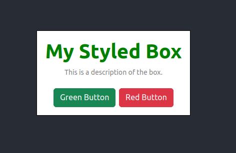

# SPA-styling-in-react

## Create a Styled Box with Sass

Create a styled box component `MyComponent` with Sass support that meets the following requirements:

1.  The box should have a white background and a black border.
2.  The title of the box should be in green color and bold. Content should be: "My Styled Box".
3.  The description of the box should be in gray color and have a font size of 14 pixels. Content should be: "This is a description of the box."
4.  The box should have a maximum width of 400 pixels and be horizontally centered on the page.

## Add Bootstrap Components

Add two Bootstrap buttons to a new component that meets the following requirements:

1.  The first button should have a green background color and white text.
2.  The second button should have a red background color and white text.
3.  The buttons should be horizontally centered on the page.

## Bring them together

Combine the styled box component and the Bootstrap buttons in a new component that displays both on the page. The component should be horizontally centered on the page and have a margin of 50 pixels from the top of the page.

## Final Result

