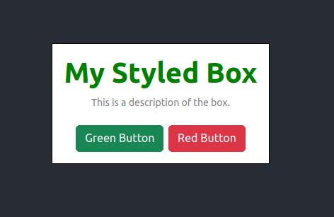

# SPA-styling-in-react

## Gestaltete Box mit Sass erstellen

Erstelle eine gestaltete Box-Komponente `MyComponent` mit Sass-Unterstützung, die folgende Anforderungen erfüllt:

1.  Die Box sollte einen weißen Hintergrund und einen schwarzen Rahmen haben.
2.  Der Titel der Box sollte in grüner Farbe und in Fett gedruckt sein und folgenden Inhalt haben: "My Styled Box".
3.  Die Beschreibung der Box sollte in grauer Farbe sein und eine Schriftgröße von 14 Pixeln haben und folgenden Inhalt haben: "This is a description of the box."
4.  Die Box sollte eine maximale Breite von 400 Pixeln haben und horizontal zentriert auf der Seite positioniert sein.

## Bootstrap-Komponenten hinzufügen

Füge zwei Bootstrap-Buttons in eine neue Komponente ein, die folgende Anforderungen erfüllt:

1.  Der erste Button sollte eine grüne Hintergrundfarbe und einen weißen Text haben.
2.  Der zweite Button sollte eine rote Hintergrundfarbe und einen weißen Text haben.
3.  Die Buttons sollten horizontal zentriert auf der Seite positioniert sein.

## Zusammenführen

Kombiniere die gestaltete Box-Komponente und die Bootstrap-Komponenten in einer neuen Komponente, die beide auf der Seite anzeigt. Die Komponente sollte horizontal zentriert auf der Seite positioniert sein und einen Abstand von 50 Pixeln zum oberen Rand der Seite haben.

## Endergebnis

